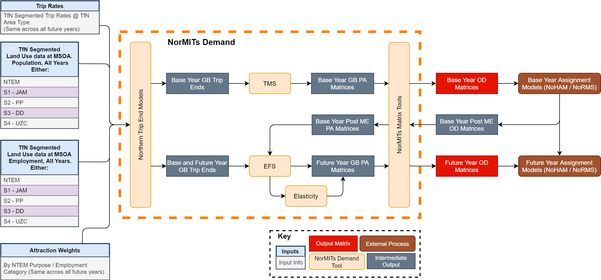

----

# NorMITs Demand

In short, NorMITs Demand is Transport for the North's (TfN) mainland GB
demand tools.
These tools started out as Northern specific models, however they are
currently moving towards more flexible zoning to allow them to be applicable
to elsewhere in mainland GB too.

We're keen to support sharing these tools where we can,
see [support](#sharing) for more information.

#### Contents
 - [Summary](#summary) 
 - [Required Data](#required-data)
 - [Quick Start Guide](#quick-start-guide)
 - [Documentation](#documentation)
 - [Planned Improvements](#planned-improvements)
 - [Sharing](#sharing)
   - [Sharing Models](#sharing-models)
   - [Sharing Requests](#sharing-requests)
 - [Gory Details](#gory-details)
   - [Northern Trip End Model](#northern-trip-end-model)
   - [Travel Market Synthesiser](#travel-market-synthesiser)
   - [External Forecast System](#external-forecast-system)
   - [NorMITs Matrix Tools](#matrix-tools)

## Summary
NorMITs Demand is made up of a number of smaller models, each with their own
individual purpose.
For further information on how these models work, click the links in their names.
Currently, the NorMITs Demand models are capable of building the following:
- [Northern Trip End Model](#northern-trip-end-model) (**NoTEM**) -
  MSOA modelled trip ends (base and future year)
  based on the provided Land Use and NTS data. (Link to other repos)
- [Travel Market Synthesiser](#travel-market-synthesiser) (**TMS**) -
  Builds the synthetic base year matrices, by distributing
  the trip end data provided by NoTEM.
- [External Forecast System](#external-forecast-system) (**EFS**) - 
  Future Year forecast matrices, built on top of the 
  Post-Matrix-Estimation matrices provided, the trip ends from NoTEM, and
  the more accurate distributions from TMS.
- [Elasticity Model](#external-forecast-system) -
  Cost-change adjusted future year forecast matrices, taking exogenous
  cost changes into account, and adjusts the outputs of the EFS matrices.
- [NorMITs Matrix Tools](#matrix-tools) -
  A collection of tools for manipulating matrices that underpins much of 
  the work done by TMS and EFS.

NorMITs  Demand has been built in a modular way, so that each sub-model can
be swapped out for any model that uses the same inputs to make the same outputs.
For example, if you already have a set of base and future year trip ends that
you would like to use in-place of NoTEM, they can be slotted in.
How these models interact can be seen below, grey and red boxes indicate where
alternate inputs/outputs could be used:

## Required Data

## Quick Start Guide!

## Documentation
Current code documentation can only be found in the codebase. One of the 
planned improvements include getting this hosted online, so it's easily
accessible!

## Planned Improvements
What do we plan to update in future releases?

## Sharing
TfN's Technical Assurance, Modelling and Economics (**TAME**) team have done
a great deal of work to develop TfN’s Analytical Framework.
As part of this, we would like to start sharing some of our tools, NorMITs 
Demand included.

### Sharing Models
We've categorised out ways of sharing into 3 different profiles, each with 
a distinct risk/reward profile.

#### 1. Utilisation of Open Source tools and casual TfN support.
This includes forking our repository and mostly working without TfN support.
This profile would be facilitated though submitting issues and TfN clarification
supporting where possible.

#### 2. TfN Builds outputs *for* requester
Data requests will be submitted using the [requests](#sharing-requests) process.
TfN will then assess the feasibility, and aim to build and hand over the
required outputs.

#### 3. TfN Builds outputs *with* requester 
Data requests will be submitted using the [requests](#sharing-requests) process.
TfN will then assess the feasibility, and a discussion will begin to decide how
best to work together to produce the required output.

### Sharing Requests

If you are interested in acquiring any of the data, or would like some support
in utilising NorMITs Demand, please submit your requests to
data.requests@transportforthenorth.com.

All requests should contain the following information:
- Requestor Name
- Requestor Organisation
- Request Date
- Required by date
- Expected deliverables
- Format required, where possible
- Purpose of data
- Will data be published?
- Comments

Please note that the TAME team are in high demand with limited resources so
responses to requests may not be immediate.
However, the team will endeavour to provide you with an estimate of how long
it would take to share the data.

## Gory Details
This section talks about how each of the models in the NorMITs Demand suite work
in detail. It will provide more insight into the transport methodologies used,
and the coding detail that makes it so fast. If you are looking for more of an 
overview, look [here](#summary)!

### Northern Trip End Model
Talk about DVector, zoning systems and segmentations

### Travel Market Synthesiser
Talk about TLD constrained furness, gravity model. Upper and Lower tiers

### External Forecast System
Growth on Post-ME, WFH adjustment, distribution method
NTEM forecast??

### Elasticity Model
GC based Own Elasticity approach

### Matrix Tools
Segment Tier Converter
PA2OD
OD2PA